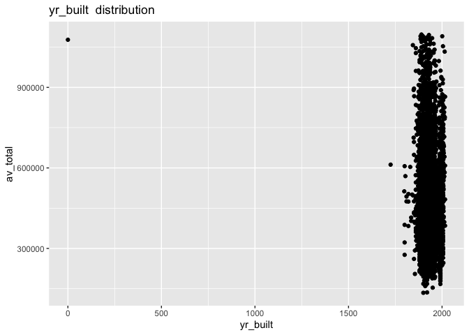

Challenge 3 Starter
================

## Library

``` r
library(tidymodels)
library(tidyverse)
library(janitor)
library(vip)
library(skimr)
```

## DATA

import data

``` r
boston <- read_csv("boston_train.csv") %>% clean_names()
kaggle <- read_csv("boston_holdout.csv") %>% clean_names()
zips   <- read_csv("zips.csv") %>% clean_names()
head(boston)
```

    ## # A tibble: 6 × 33
    ##     pid zipcode own_occ av_total land_sf yr_bu…¹ yr_re…² livin…³ num_f…⁴ struc…⁵
    ##   <dbl>   <dbl> <chr>      <dbl>   <dbl>   <dbl>   <dbl>   <dbl>   <dbl> <chr>  
    ## 1    10    2136 Y         321200   10288    1992       0    1681     1   R      
    ## 2    40    2124 Y         450500    3187    1900    2001    1868     2   R      
    ## 3    70    2130 Y         794300    6007    1962    2001    2146     2   R      
    ## 4    80    2136 Y         342100    5500    1949    2002    1357     1.5 R      
    ## 5    90    2124 Y         444700    3026    1900       0    2346     2.5 R      
    ## 6   100    2131 Y         518500    4950    1900    2012    2032     2   R      
    ## # … with 23 more variables: r_bldg_styl <chr>, r_roof_typ <chr>,
    ## #   r_ext_fin <chr>, r_total_rms <dbl>, r_bdrms <dbl>, r_full_bth <dbl>,
    ## #   r_half_bth <dbl>, r_bth_style <chr>, r_kitch <dbl>, r_kitch_style <chr>,
    ## #   r_heat_typ <chr>, r_ac <chr>, r_fplace <dbl>, r_ext_cnd <chr>,
    ## #   r_ovrall_cnd <chr>, r_int_cnd <chr>, r_int_fin <chr>, r_view <chr>,
    ## #   zip <chr>, population <dbl>, pop_density <dbl>, median_income <dbl>,
    ## #   city_state <chr>, and abbreviated variable names ¹​yr_built, ²​yr_remod, …

``` r
head(zips)
```

    ## # A tibble: 6 × 5
    ##   zip   population pop_density median_income city_state           
    ##   <chr>      <dbl>       <dbl>         <dbl> <chr>                
    ## 1 02132      36314       13251         75446 Cambridge, MA        
    ## 2 02124      47783       15913         48841 Dorchester Center, MA
    ## 3 02131      29826       11505         66735 Roslindale, MA       
    ## 4 02136      28488        6207         58890 Hyde Park, MA        
    ## 5 02130      35401       10618         75730 Jamaica Plain, MA    
    ## 6 02138      36314       13251         75446 Cambridge, MA

``` r
boston %>% skim()
```

|                                                  |            |
|:-------------------------------------------------|:-----------|
| Name                                             | Piped data |
| Number of rows                                   | 9959       |
| Number of columns                                | 33         |
| \_\_\_\_\_\_\_\_\_\_\_\_\_\_\_\_\_\_\_\_\_\_\_   |            |
| Column type frequency:                           |            |
| character                                        | 16         |
| numeric                                          | 17         |
| \_\_\_\_\_\_\_\_\_\_\_\_\_\_\_\_\_\_\_\_\_\_\_\_ |            |
| Group variables                                  | None       |

Data summary

**Variable type: character**

| skim_variable   | n_missing | complete_rate | min | max | empty | n_unique | whitespace |
|:----------------|----------:|--------------:|----:|----:|------:|---------:|-----------:|
| own_occ         |         0 |             1 |   1 |   1 |     0 |        2 |          0 |
| structure_class |         0 |             1 |   1 |   1 |     0 |        1 |          0 |
| r_bldg_styl     |         0 |             1 |   2 |   2 |     0 |       16 |          0 |
| r_roof_typ      |         0 |             1 |   1 |   1 |     0 |        7 |          0 |
| r_ext_fin       |         0 |             1 |   1 |   1 |     0 |       10 |          0 |
| r_bth_style     |         0 |             1 |   1 |   1 |     0 |        4 |          0 |
| r_kitch_style   |         0 |             1 |   1 |   1 |     0 |        4 |          0 |
| r_heat_typ      |         0 |             1 |   1 |   1 |     0 |        7 |          0 |
| r_ac            |         0 |             1 |   1 |   1 |     0 |        3 |          0 |
| r_ext_cnd       |         0 |             1 |   1 |   1 |     0 |        5 |          0 |
| r_ovrall_cnd    |         0 |             1 |   1 |   1 |     0 |        5 |          0 |
| r_int_cnd       |         0 |             1 |   1 |   1 |     0 |        5 |          0 |
| r_int_fin       |         0 |             1 |   1 |   1 |     0 |        2 |          0 |
| r_view          |         0 |             1 |   1 |   1 |     0 |        5 |          0 |
| zip             |         0 |             1 |   5 |   5 |     0 |        5 |          0 |
| city_state      |         0 |             1 |  13 |  21 |     0 |        5 |          0 |

**Variable type: numeric**

| skim_variable | n_missing | complete_rate |      mean |        sd |     p0 |      p25 |    p50 |    p75 |    p100 | hist  |
|:--------------|----------:|--------------:|----------:|----------:|-------:|---------:|-------:|-------:|--------:|:------|
| pid           |         0 |          1.00 |  71093.60 |  41011.82 |     10 |  35780.0 |  71180 | 106575 |  142240 | ▇▇▇▇▇ |
| zipcode       |         0 |          1.00 |   2131.45 |      3.69 |   2124 |   2131.0 |   2132 |   2132 |    2136 | ▃▁▆▇▆ |
| av_total      |         0 |          1.00 | 448563.64 | 147761.17 | 134800 | 347100.0 | 418700 | 510150 | 1097100 | ▂▇▂▁▁ |
| land_sf       |         0 |          1.00 |   5936.18 |   2954.01 |    920 |   4319.0 |   5320 |   6756 |  107158 | ▇▁▁▁▁ |
| yr_built      |         0 |          1.00 |   1933.40 |     35.28 |      0 |   1910.0 |   1931 |   1955 |    2016 | ▁▁▁▁▇ |
| yr_remod      |       347 |          0.97 |    675.71 |    946.59 |      0 |      0.0 |      0 |   1997 |    2016 | ▇▁▁▁▅ |
| living_area   |         0 |          1.00 |   1659.00 |    545.95 |    332 |   1300.0 |   1554 |   1914 |    8623 | ▇▂▁▁▁ |
| num_floors    |         0 |          1.00 |      1.73 |      0.45 |      1 |      1.5 |      2 |      2 |       3 | ▃▂▇▁▁ |
| r_total_rms   |         0 |          1.00 |      7.11 |      1.55 |      3 |      6.0 |      7 |      8 |      17 | ▁▇▂▁▁ |
| r_bdrms       |         0 |          1.00 |      3.34 |      0.92 |      0 |      3.0 |      3 |      4 |       9 | ▁▇▃▁▁ |
| r_full_bth    |         0 |          1.00 |      1.35 |      0.56 |      1 |      1.0 |      1 |      2 |       6 | ▇▁▁▁▁ |
| r_half_bth    |         0 |          1.00 |      0.56 |      0.55 |      0 |      0.0 |      1 |      1 |      10 | ▇▁▁▁▁ |
| r_kitch       |         0 |          1.00 |      1.02 |      0.14 |      1 |      1.0 |      1 |      1 |       3 | ▇▁▁▁▁ |
| r_fplace      |         0 |          1.00 |      0.60 |      0.62 |      0 |      0.0 |      1 |      1 |       5 | ▇▁▁▁▁ |
| population    |         0 |          1.00 |  34871.56 |   6299.30 |  28488 |  29826.0 |  35401 |  36314 |   47783 | ▇▂▆▁▃ |
| pop_density   |         0 |          1.00 |  11368.99 |   3293.58 |   6207 |  10618.0 |  11505 |  13251 |   15913 | ▆▁▆▇▃ |
| median_income |         0 |          1.00 |  65984.07 |   9749.72 |  48841 |  58890.0 |  66735 |  75446 |   75730 | ▃▅▁▃▇ |

Combine zip to boston dataset. Remove null and add age variable.

``` r
zips <- zips %>%
  mutate(zip = as.integer(zip))

# I filled na values in land_sf with the mean value, and na values in yr_remod with 0. Now there is no null value.
boston <- boston %>%
  left_join(zips, by = c("zipcode" = "zip")) %>%
  mutate(land_sf = replace_na(land_sf,mean(land_sf,na.rm=T))) %>%
  mutate(yr_remod = replace_na(yr_remod,0)) %>%
  mutate(remod_yes = as.factor(ifelse(yr_remod == 0,0,1))) %>%
  mutate(home_age = if_else(yr_remod > yr_built, 2022 - yr_remod, 2022 - yr_built))

head(boston,5)
```

    ## # A tibble: 5 × 39
    ##     pid zipcode own_occ av_total land_sf yr_bu…¹ yr_re…² livin…³ num_f…⁴ struc…⁵
    ##   <dbl>   <dbl> <chr>      <dbl>   <dbl>   <dbl>   <dbl>   <dbl>   <dbl> <chr>  
    ## 1    10    2136 Y         321200   10288    1992       0    1681     1   R      
    ## 2    40    2124 Y         450500    3187    1900    2001    1868     2   R      
    ## 3    70    2130 Y         794300    6007    1962    2001    2146     2   R      
    ## 4    80    2136 Y         342100    5500    1949    2002    1357     1.5 R      
    ## 5    90    2124 Y         444700    3026    1900       0    2346     2.5 R      
    ## # … with 29 more variables: r_bldg_styl <chr>, r_roof_typ <chr>,
    ## #   r_ext_fin <chr>, r_total_rms <dbl>, r_bdrms <dbl>, r_full_bth <dbl>,
    ## #   r_half_bth <dbl>, r_bth_style <chr>, r_kitch <dbl>, r_kitch_style <chr>,
    ## #   r_heat_typ <chr>, r_ac <chr>, r_fplace <dbl>, r_ext_cnd <chr>,
    ## #   r_ovrall_cnd <chr>, r_int_cnd <chr>, r_int_fin <chr>, r_view <chr>,
    ## #   zip <chr>, population.x <dbl>, pop_density.x <dbl>, median_income.x <dbl>,
    ## #   city_state.x <chr>, population.y <dbl>, pop_density.y <dbl>, …

### Skim

Check histogram for skewed data

``` r
boston %>% skim()
```

|                                                  |            |
|:-------------------------------------------------|:-----------|
| Name                                             | Piped data |
| Number of rows                                   | 9959       |
| Number of columns                                | 39         |
| \_\_\_\_\_\_\_\_\_\_\_\_\_\_\_\_\_\_\_\_\_\_\_   |            |
| Column type frequency:                           |            |
| character                                        | 17         |
| factor                                           | 1          |
| numeric                                          | 21         |
| \_\_\_\_\_\_\_\_\_\_\_\_\_\_\_\_\_\_\_\_\_\_\_\_ |            |
| Group variables                                  | None       |

Data summary

**Variable type: character**

| skim_variable   | n_missing | complete_rate | min | max | empty | n_unique | whitespace |
|:----------------|----------:|--------------:|----:|----:|------:|---------:|-----------:|
| own_occ         |         0 |             1 |   1 |   1 |     0 |        2 |          0 |
| structure_class |         0 |             1 |   1 |   1 |     0 |        1 |          0 |
| r_bldg_styl     |         0 |             1 |   2 |   2 |     0 |       16 |          0 |
| r_roof_typ      |         0 |             1 |   1 |   1 |     0 |        7 |          0 |
| r_ext_fin       |         0 |             1 |   1 |   1 |     0 |       10 |          0 |
| r_bth_style     |         0 |             1 |   1 |   1 |     0 |        4 |          0 |
| r_kitch_style   |         0 |             1 |   1 |   1 |     0 |        4 |          0 |
| r_heat_typ      |         0 |             1 |   1 |   1 |     0 |        7 |          0 |
| r_ac            |         0 |             1 |   1 |   1 |     0 |        3 |          0 |
| r_ext_cnd       |         0 |             1 |   1 |   1 |     0 |        5 |          0 |
| r_ovrall_cnd    |         0 |             1 |   1 |   1 |     0 |        5 |          0 |
| r_int_cnd       |         0 |             1 |   1 |   1 |     0 |        5 |          0 |
| r_int_fin       |         0 |             1 |   1 |   1 |     0 |        2 |          0 |
| r_view          |         0 |             1 |   1 |   1 |     0 |        5 |          0 |
| zip             |         0 |             1 |   5 |   5 |     0 |        5 |          0 |
| city_state.x    |         0 |             1 |  13 |  21 |     0 |        5 |          0 |
| city_state.y    |         0 |             1 |  13 |  21 |     0 |        5 |          0 |

**Variable type: factor**

| skim_variable | n_missing | complete_rate | ordered | n_unique | top_counts       |
|:--------------|----------:|--------------:|:--------|---------:|:-----------------|
| remod_yes     |         0 |             1 | FALSE   |        2 | 0: 6714, 1: 3245 |

**Variable type: numeric**

| skim_variable   | n_missing | complete_rate |      mean |        sd |     p0 |      p25 |    p50 |    p75 |    p100 | hist  |
|:----------------|----------:|--------------:|----------:|----------:|-------:|---------:|-------:|-------:|--------:|:------|
| pid             |         0 |             1 |  71093.60 |  41011.82 |     10 |  35780.0 |  71180 | 106575 |  142240 | ▇▇▇▇▇ |
| zipcode         |         0 |             1 |   2131.45 |      3.69 |   2124 |   2131.0 |   2132 |   2132 |    2136 | ▃▁▆▇▆ |
| av_total        |         0 |             1 | 448563.64 | 147761.17 | 134800 | 347100.0 | 418700 | 510150 | 1097100 | ▂▇▂▁▁ |
| land_sf         |         0 |             1 |   5936.18 |   2954.01 |    920 |   4319.0 |   5320 |   6756 |  107158 | ▇▁▁▁▁ |
| yr_built        |         0 |             1 |   1933.40 |     35.28 |      0 |   1910.0 |   1931 |   1955 |    2016 | ▁▁▁▁▇ |
| yr_remod        |         0 |             1 |    652.17 |    938.17 |      0 |      0.0 |      0 |   1995 |    2016 | ▇▁▁▁▃ |
| living_area     |         0 |             1 |   1659.00 |    545.95 |    332 |   1300.0 |   1554 |   1914 |    8623 | ▇▂▁▁▁ |
| num_floors      |         0 |             1 |      1.73 |      0.45 |      1 |      1.5 |      2 |      2 |       3 | ▃▂▇▁▁ |
| r_total_rms     |         0 |             1 |      7.11 |      1.55 |      3 |      6.0 |      7 |      8 |      17 | ▁▇▂▁▁ |
| r_bdrms         |         0 |             1 |      3.34 |      0.92 |      0 |      3.0 |      3 |      4 |       9 | ▁▇▃▁▁ |
| r_full_bth      |         0 |             1 |      1.35 |      0.56 |      1 |      1.0 |      1 |      2 |       6 | ▇▁▁▁▁ |
| r_half_bth      |         0 |             1 |      0.56 |      0.55 |      0 |      0.0 |      1 |      1 |      10 | ▇▁▁▁▁ |
| r_kitch         |         0 |             1 |      1.02 |      0.14 |      1 |      1.0 |      1 |      1 |       3 | ▇▁▁▁▁ |
| r_fplace        |         0 |             1 |      0.60 |      0.62 |      0 |      0.0 |      1 |      1 |       5 | ▇▁▁▁▁ |
| population.x    |         0 |             1 |  34871.56 |   6299.30 |  28488 |  29826.0 |  35401 |  36314 |   47783 | ▇▂▆▁▃ |
| pop_density.x   |         0 |             1 |  11368.99 |   3293.58 |   6207 |  10618.0 |  11505 |  13251 |   15913 | ▆▁▆▇▃ |
| median_income.x |         0 |             1 |  65984.07 |   9749.72 |  48841 |  58890.0 |  66735 |  75446 |   75730 | ▃▅▁▃▇ |
| population.y    |         0 |             1 |  34871.56 |   6299.30 |  28488 |  29826.0 |  35401 |  36314 |   47783 | ▇▂▆▁▃ |
| pop_density.y   |         0 |             1 |  11368.99 |   3293.58 |   6207 |  10618.0 |  11505 |  13251 |   15913 | ▆▁▆▇▃ |
| median_income.y |         0 |             1 |  65984.07 |   9749.72 |  48841 |  58890.0 |  66735 |  75446 |   75730 | ▃▅▁▃▇ |
| home_age        |         0 |             1 |     63.80 |     39.80 |      6 |     22.0 |     67 |     97 |     297 | ▇▇▁▁▁ |

### Frequency analysis with numerical data

``` r
boston %>%
  pivot_longer(cols = where(is.numeric), names_to = "column", values_to="value") %>%
  dplyr::select(column, value) %>%
  group_by(column) %>%
  summarise(count = n(),
            n_miss = sum(is.na(value)),
            n_distinct = n_distinct(value)) %>%
  mutate(count = count - n_miss, pct_distinct = n_distinct / count) %>%
  arrange(desc(pct_distinct))
```

    ## # A tibble: 21 × 5
    ##    column      count n_miss n_distinct pct_distinct
    ##    <chr>       <int>  <int>      <int>        <dbl>
    ##  1 pid          9959      0       9959     1       
    ##  2 land_sf      9959      0       4550     0.457   
    ##  3 av_total     9959      0       4384     0.440   
    ##  4 living_area  9959      0       2126     0.213   
    ##  5 yr_built     9959      0        170     0.0171  
    ##  6 home_age     9959      0        161     0.0162  
    ##  7 yr_remod     9959      0         77     0.00773 
    ##  8 r_total_rms  9959      0         15     0.00151 
    ##  9 r_bdrms      9959      0         10     0.00100 
    ## 10 r_fplace     9959      0          6     0.000602
    ## # … with 11 more rows

## Explore Numeric Variables

I’d do some kind of descriptive statistics analysis, what variables can
i exclude?

``` r
boston %>%
  pivot_longer(cols = where(is.numeric), names_to = "column", values_to="value") %>%
  dplyr::select(column, value) %>%
  group_by(column) %>%
  summarise(count = n(),
            n_miss = sum(is.na(value)),
            n_distinct = n_distinct(value),
            mean = mean(value, na.rm = TRUE),
            median = median(value, na.rm = TRUE),
            min = min(value, na.rm = TRUE),
            max = max(value, na.rm = TRUE),
            sd = sd(value, na.rm = TRUE),
            )
```

    ## # A tibble: 21 × 9
    ##    column          count n_miss n_distinct     mean median    min    max      sd
    ##    <chr>           <int>  <int>      <int>    <dbl>  <dbl>  <dbl>  <dbl>   <dbl>
    ##  1 av_total         9959      0       4384   4.49e5 418700 134800 1.10e6 1.48e+5
    ##  2 home_age         9959      0        161   6.38e1     67      6 2.97e2 3.98e+1
    ##  3 land_sf          9959      0       4550   5.94e3   5320    920 1.07e5 2.95e+3
    ##  4 living_area      9959      0       2126   1.66e3   1554    332 8.62e3 5.46e+2
    ##  5 median_income.x  9959      0          5   6.60e4  66735  48841 7.57e4 9.75e+3
    ##  6 median_income.y  9959      0          5   6.60e4  66735  48841 7.57e4 9.75e+3
    ##  7 num_floors       9959      0          5   1.73e0      2      1 3   e0 4.48e-1
    ##  8 pid              9959      0       9959   7.11e4  71180     10 1.42e5 4.10e+4
    ##  9 pop_density.x    9959      0          5   1.14e4  11505   6207 1.59e4 3.29e+3
    ## 10 pop_density.y    9959      0          5   1.14e4  11505   6207 1.59e4 3.29e+3
    ## # … with 11 more rows

Transform variables from initial analysis

``` r
boston <- boston %>% 
  #subset(.,select = -c(zipcode)) %>%
  mutate_if(is.character,factor) %>%
  mutate(built_in_90s = as.factor(ifelse((yr_built<=1999)&(yr_built>=1990),1,0)))

boston %>% skim_without_charts()
```

|                                                  |            |
|:-------------------------------------------------|:-----------|
| Name                                             | Piped data |
| Number of rows                                   | 9959       |
| Number of columns                                | 40         |
| \_\_\_\_\_\_\_\_\_\_\_\_\_\_\_\_\_\_\_\_\_\_\_   |            |
| Column type frequency:                           |            |
| factor                                           | 19         |
| numeric                                          | 21         |
| \_\_\_\_\_\_\_\_\_\_\_\_\_\_\_\_\_\_\_\_\_\_\_\_ |            |
| Group variables                                  | None       |

Data summary

**Variable type: factor**

| skim_variable   | n_missing | complete_rate | ordered | n_unique | top_counts                                 |
|:----------------|----------:|--------------:|:--------|---------:|:-------------------------------------------|
| own_occ         |         0 |             1 | FALSE   |        2 | Y: 8785, N: 1174                           |
| structure_class |         0 |             1 | FALSE   |        1 | R: 9959                                    |
| r_bldg_styl     |         0 |             1 | FALSE   |       16 | CL: 5957, CP: 1637, RN: 717, BW: 487       |
| r_roof_typ      |         0 |             1 | FALSE   |        7 | G: 7839, H: 1354, L: 526, M: 108           |
| r_ext_fin       |         0 |             1 | FALSE   |       10 | M: 5433, W: 2761, F: 753, A: 429           |
| r_bth_style     |         0 |             1 | FALSE   |        4 | S: 6563, M: 2760, N: 614, L: 22            |
| r_kitch_style   |         0 |             1 | FALSE   |        4 | S: 5900, M: 3387, N: 627, L: 45            |
| r_heat_typ      |         0 |             1 | FALSE   |        7 | W: 7304, F: 2475, E: 127, P: 25            |
| r_ac            |         0 |             1 | FALSE   |        3 | N: 8289, C: 1626, D: 44                    |
| r_ext_cnd       |         0 |             1 | FALSE   |        5 | A: 8112, G: 1582, F: 251, P: 12            |
| r_ovrall_cnd    |         0 |             1 | FALSE   |        5 | A: 8243, G: 1632, F: 76, P: 7              |
| r_int_cnd       |         0 |             1 | FALSE   |        5 | A: 7133, G: 2684, F: 122, E: 12            |
| r_int_fin       |         0 |             1 | FALSE   |        2 | N: 9952, E: 7                              |
| r_view          |         0 |             1 | FALSE   |        5 | A: 9358, G: 316, F: 264, E: 11             |
| zip             |         0 |             1 | FALSE   |        5 | 021: 3409, 021: 2445, 021: 1726, 021: 1465 |
| city_state.x    |         0 |             1 | FALSE   |        5 | Cam: 3409, Hyd: 2445, Ros: 1726, Dor: 1465 |
| city_state.y    |         0 |             1 | FALSE   |        5 | Cam: 3409, Hyd: 2445, Ros: 1726, Dor: 1465 |
| remod_yes       |         0 |             1 | FALSE   |        2 | 0: 6714, 1: 3245                           |
| built_in_90s    |         0 |             1 | FALSE   |        2 | 0: 9725, 1: 234                            |

**Variable type: numeric**

| skim_variable   | n_missing | complete_rate |      mean |        sd |     p0 |      p25 |    p50 |    p75 |    p100 |
|:----------------|----------:|--------------:|----------:|----------:|-------:|---------:|-------:|-------:|--------:|
| pid             |         0 |             1 |  71093.60 |  41011.82 |     10 |  35780.0 |  71180 | 106575 |  142240 |
| zipcode         |         0 |             1 |   2131.45 |      3.69 |   2124 |   2131.0 |   2132 |   2132 |    2136 |
| av_total        |         0 |             1 | 448563.64 | 147761.17 | 134800 | 347100.0 | 418700 | 510150 | 1097100 |
| land_sf         |         0 |             1 |   5936.18 |   2954.01 |    920 |   4319.0 |   5320 |   6756 |  107158 |
| yr_built        |         0 |             1 |   1933.40 |     35.28 |      0 |   1910.0 |   1931 |   1955 |    2016 |
| yr_remod        |         0 |             1 |    652.17 |    938.17 |      0 |      0.0 |      0 |   1995 |    2016 |
| living_area     |         0 |             1 |   1659.00 |    545.95 |    332 |   1300.0 |   1554 |   1914 |    8623 |
| num_floors      |         0 |             1 |      1.73 |      0.45 |      1 |      1.5 |      2 |      2 |       3 |
| r_total_rms     |         0 |             1 |      7.11 |      1.55 |      3 |      6.0 |      7 |      8 |      17 |
| r_bdrms         |         0 |             1 |      3.34 |      0.92 |      0 |      3.0 |      3 |      4 |       9 |
| r_full_bth      |         0 |             1 |      1.35 |      0.56 |      1 |      1.0 |      1 |      2 |       6 |
| r_half_bth      |         0 |             1 |      0.56 |      0.55 |      0 |      0.0 |      1 |      1 |      10 |
| r_kitch         |         0 |             1 |      1.02 |      0.14 |      1 |      1.0 |      1 |      1 |       3 |
| r_fplace        |         0 |             1 |      0.60 |      0.62 |      0 |      0.0 |      1 |      1 |       5 |
| population.x    |         0 |             1 |  34871.56 |   6299.30 |  28488 |  29826.0 |  35401 |  36314 |   47783 |
| pop_density.x   |         0 |             1 |  11368.99 |   3293.58 |   6207 |  10618.0 |  11505 |  13251 |   15913 |
| median_income.x |         0 |             1 |  65984.07 |   9749.72 |  48841 |  58890.0 |  66735 |  75446 |   75730 |
| population.y    |         0 |             1 |  34871.56 |   6299.30 |  28488 |  29826.0 |  35401 |  36314 |   47783 |
| pop_density.y   |         0 |             1 |  11368.99 |   3293.58 |   6207 |  10618.0 |  11505 |  13251 |   15913 |
| median_income.y |         0 |             1 |  65984.07 |   9749.72 |  48841 |  58890.0 |  66735 |  75446 |   75730 |
| home_age        |         0 |             1 |     63.80 |     39.80 |      6 |     22.0 |     67 |     97 |     297 |

## Explanatory Analysis on Predictors

``` r
options(scipen = 999)

ggplot(boston, aes(x=built_in_90s,y=av_total)) +
          geom_boxplot() +
          labs(title = "Do homes built in the 90s have higher values?", y = "av_total")
```

<!-- -->

``` r
ggplot(boston, aes(x=remod_yes,y=av_total)) +
          geom_boxplot() +
          labs(title = "Do home recently remodeled have higher values?", y = "av_total")
```

<!-- -->

``` r
ggplot(boston, aes(x=home_age,y=av_total)) +
          geom_point() + geom_vline(xintercept=mean(boston$home_age),color="red",linetype = "longdash") + 
          labs(title = "Home age vs av_total") 
```

<!-- -->

``` r
ggplot(boston, aes(x=home_age)) +
          geom_histogram(bins=20) +
          labs(title = "Home age", y = "count")
```

<!-- -->

``` r
for (c in names(boston %>% dplyr::select(!c(pid,av_total,population.y,pop_density.y,median_income.y,city_state.y)))) {
  if (c %in% names(boston %>% dplyr::select(where(is.factor)))) {
    # -- for each character column create a chart
    print( boston %>%
             ggplot(., aes(x=!!as.name(c),y=av_total)) +
          geom_boxplot() +
          labs(title = paste(c," distribution"), y = "av_total"))
  } else {
    # -- comparative scatterplots
   print(ggplot(boston, aes(y=av_total, x=!!as.name(c)))+ geom_point() +labs(title = paste(c," distribution")))
  }
}
```

<!-- --><!-- --><!-- --><!-- --><!-- --><!-- --><!-- --><!-- --><!-- --><!-- --><!-- --><!-- --><!-- --><!-- --><!-- --><!-- --><!-- --><!-- --><!-- --><!-- --><!-- --><!-- --><!-- --><!-- --><!-- --><!-- --><!-- --><!-- --><!-- --><!-- --><!-- --><!-- --><!-- --><!-- -->

## Histogram Target

The first plot shows us that the data are right-skewed; there are more
inexpensive houses than expensive ones. When modeling this type of
outcome, a strong argument can be made that the price should be
log-transformed. The advantages of this type of transformation are that
no houses would be predicted with negative sale prices and that errors
in predicting expensive houses will not have an undue influence on the
model. you can deal with this in the recipe

``` r
options(scipen = 999)
ggplot(boston, aes(x = av_total)) + 
  geom_histogram(bins = 50, col= "white") +
  labs(title="Home Values of Boston Housing")
```

<!-- -->

``` r
ggplot(boston, aes(x = av_total)) + 
  geom_histogram(bins = 50, col= "white") +
  scale_x_log10() +
  labs(title="Log Home Values of Boston Housing")
```

<!-- -->

## Partition our data 70/30 PLUS make K-Fold Cross Validation

Split the data 70 % train, 30% test, then make a 5 or 10 fold dataset
from the test set.

``` r
set.seed(123)
# Save the split information for an 70/30 split of the data
bsplit <- initial_split(boston, prop = 0.80)
train <- training(bsplit) 
test  <-  testing(bsplit)

# Kfold cross validation
kfold_splits <- vfold_cv(train, v=10)


sprintf("Train PCT : %1.2f%%", nrow(train)/ nrow(boston) * 100)
```

    ## [1] "Train PCT : 80.00%"

``` r
sprintf("Test  PCT : %1.2f%%", nrow(test)/ nrow(boston) * 100)
```

    ## [1] "Test  PCT : 20.00%"

## Recipe

Write your recipe out using formula, here i’ve make a simple recipe with
5 predictors, I recomend avoiding using AV_TOTAL \~ .

``` r
# write out the formula 

  
boston_recipe <-
  recipe(av_total ~ own_occ+land_sf+home_age+   yr_remod+living_area+   num_floors+structure_class+ r_bldg_styl+    r_roof_typ+ r_ext_fin+  r_total_rms+r_bdrms+r_full_bth+r_half_bth+r_bth_style+r_kitch+r_kitch_style+r_heat_typ+r_ac+    r_fplace+   r_ext_cnd+  r_ovrall_cnd+   r_int_cnd   +r_int_fin+ r_view+ population.y+   pop_density.y+median_income.y+city_state.y+remod_yes+built_in_90s, data = train) %>%
  #step_impute_median(all_numeric_predictors()) %>% # missing values numeric 
  step_novel(all_nominal_predictors()) %>% # new factor levels 
  #step_unknown(all_nominal_predictors()) %>% # missing values 
  step_dummy(all_nominal_predictors(),one_hot = T) %>%
  step_nzv(all_predictors()) 

## Check the recipe results m
bake(boston_recipe %>% prep(),train %>% sample_n(1000))
```

    ## # A tibble: 1,000 × 48
    ##    land_sf home_age living_area num_fl…¹ r_tot…² r_bdrms r_ful…³ r_hal…⁴ r_fpl…⁵
    ##      <dbl>    <dbl>       <dbl>    <dbl>   <dbl>   <dbl>   <dbl>   <dbl>   <dbl>
    ##  1    5500       72        1064      1         7       4       2       0       1
    ##  2    3253       10        1735      2         7       4       1       1       0
    ##  3    7775       21        2124      2         7       4       2       1       1
    ##  4    4100      122        1584      2         6       2       1       1       0
    ##  5    8000        8        2759      2         8       4       2       1       0
    ##  6    4128       22        1436      2.5       7       3       1       1       0
    ##  7    8012        7        1718      1         7       4       1       1       0
    ##  8    5200       62        1140      1         6       3       2       0       2
    ##  9    6807      132        3544      2        10       4       2       0       1
    ## 10    3400       72        1368      2         6       3       1       0       1
    ## # … with 990 more rows, 39 more variables: population.y <dbl>,
    ## #   pop_density.y <dbl>, median_income.y <dbl>, av_total <dbl>,
    ## #   own_occ_N <int>, own_occ_Y <int>, r_bldg_styl_CL <int>,
    ## #   r_bldg_styl_CP <int>, r_bldg_styl_RN <int>, r_roof_typ_G <int>,
    ## #   r_roof_typ_H <int>, r_roof_typ_L <int>, r_ext_fin_F <int>,
    ## #   r_ext_fin_M <int>, r_ext_fin_W <int>, r_bth_style_M <int>,
    ## #   r_bth_style_N <int>, r_bth_style_S <int>, r_kitch_style_M <int>, …

## Linear Reg Setup

Linear regression there is really nothing to tune unless you want to get
fancy. this is your baseline model that you should compare your work
against.

``` r
#
lm_model <- linear_reg(mixture=1, penalty = 0.01) %>%
  #set_engine("lm") %>%
  set_engine("glmnet") %>%
  set_mode("regression") 

lm_wflow <-workflow() %>%
  add_recipe(boston_recipe) %>%
  add_model(lm_model) %>%
  fit(train)

tidy(lm_wflow) %>%
  mutate_if(is.numeric,round,4)
```

    ## Loading required package: Matrix

    ## 
    ## Attaching package: 'Matrix'

    ## The following objects are masked from 'package:tidyr':
    ## 
    ##     expand, pack, unpack

    ## Loaded glmnet 4.1-4

    ## # A tibble: 48 × 3
    ##    term         estimate penalty
    ##    <chr>           <dbl>   <dbl>
    ##  1 (Intercept) -89844.      0.01
    ##  2 land_sf          7.79    0.01
    ##  3 home_age       218.      0.01
    ##  4 living_area    101.      0.01
    ##  5 num_floors   -1768.      0.01
    ##  6 r_total_rms   2467.      0.01
    ##  7 r_bdrms      -2380.      0.01
    ##  8 r_full_bth   16962.      0.01
    ##  9 r_half_bth   17838.      0.01
    ## 10 r_fplace     19619.      0.01
    ## # … with 38 more rows

``` r
lm_wflow %>%
  pull_workflow_fit() %>%
  tidy()%>%
  mutate_if(is.numeric,round,4)
```

    ## Warning: `pull_workflow_fit()` was deprecated in workflows 0.2.3.
    ## ℹ Please use `extract_fit_parsnip()` instead.

    ## # A tibble: 48 × 3
    ##    term         estimate penalty
    ##    <chr>           <dbl>   <dbl>
    ##  1 (Intercept) -89844.      0.01
    ##  2 land_sf          7.79    0.01
    ##  3 home_age       218.      0.01
    ##  4 living_area    101.      0.01
    ##  5 num_floors   -1768.      0.01
    ##  6 r_total_rms   2467.      0.01
    ##  7 r_bdrms      -2380.      0.01
    ##  8 r_full_bth   16962.      0.01
    ##  9 r_half_bth   17838.      0.01
    ## 10 r_fplace     19619.      0.01
    ## # … with 38 more rows

``` r
lm_wflow %>%
  pull_workflow_fit() %>%
  vi() %>% 
  mutate(Importance = if_else(Sign == "NEG", -Importance,Importance)) %>% 
  ggplot(aes(reorder(Variable,Importance),Importance, fill=Sign)) +
  geom_col() + coord_flip() + labs(title="Linear Model Important Variables",x="Variables")+ theme(axis.text = element_text(size = 5))
```

<!-- -->

``` r
bind_cols(
  predict(lm_wflow,train, type="numeric"), train) %>% 
  mutate(part = "train") -> score_lm_train

bind_cols(
  predict(lm_wflow,test), test) %>% mutate(part = "test") -> score_lm_test

bind_rows(score_lm_train, score_lm_test) %>% 
  group_by(part) %>% 
  metrics(av_total,.pred) %>%
  pivot_wider(id_cols = part, names_from = .metric, values_from = .estimate)
```

    ## # A tibble: 2 × 4
    ##   part    rmse   rsq    mae
    ##   <chr>  <dbl> <dbl>  <dbl>
    ## 1 test  63314. 0.816 44708.
    ## 2 train 63017. 0.818 45049.

## Random Forest with Grid Search

``` r
rf_model <- rand_forest(trees=tune(), min_n=tune()) %>%
  set_engine("ranger",importance="permutation") %>%
  set_mode("regression")

rf_wflow <-workflow() %>%
  add_recipe(boston_recipe) %>%
  add_model(rf_model)

rf_grid <- grid_regular(trees(c(100,300)), min_n(c(1,5)), levels = 5)

doParallel::registerDoParallel()

rf_grid_search <-
  tune_grid(
    rf_wflow,
    resamples = kfold_splits,
    grid = rf_grid
  )

rf_grid_search %>%  collect_metrics()
```

    ## # A tibble: 50 × 8
    ##    trees min_n .metric .estimator      mean     n   std_err .config             
    ##    <int> <int> <chr>   <chr>          <dbl> <int>     <dbl> <chr>               
    ##  1   100     1 rmse    standard   56413.       10 678.      Preprocessor1_Model…
    ##  2   100     1 rsq     standard       0.860    10   0.00487 Preprocessor1_Model…
    ##  3   150     1 rmse    standard   56277.       10 768.      Preprocessor1_Model…
    ##  4   150     1 rsq     standard       0.861    10   0.00469 Preprocessor1_Model…
    ##  5   200     1 rmse    standard   56358.       10 763.      Preprocessor1_Model…
    ##  6   200     1 rsq     standard       0.861    10   0.00467 Preprocessor1_Model…
    ##  7   250     1 rmse    standard   56312.       10 804.      Preprocessor1_Model…
    ##  8   250     1 rsq     standard       0.861    10   0.00481 Preprocessor1_Model…
    ##  9   300     1 rmse    standard   56167.       10 734.      Preprocessor1_Model…
    ## 10   300     1 rsq     standard       0.862    10   0.00454 Preprocessor1_Model…
    ## # … with 40 more rows

``` r
rf_grid_search %>%
  collect_metrics() %>%
  ggplot(aes(min_n, mean, color = .metric)) +
  geom_errorbar(aes(
    ymin = mean - std_err,
    ymax = mean + std_err
  ),
  alpha = 0.5
  ) +
  geom_line(size = 1.5) +
  facet_wrap(~.metric, scales = "free", nrow = 2) +
  scale_x_log10() +
  theme(legend.position = "none") + labs(title="Random Forest Min N Tuning Performance")
```

<!-- -->

``` r
rf_grid_search %>%
  collect_metrics() %>%
  ggplot(aes(trees, mean, color = .metric)) +
  geom_errorbar(aes(
    ymin = mean - std_err,
    ymax = mean + std_err
  ),
  alpha = 0.5
  ) +
  geom_line(size = 1.5) +
  facet_wrap(~.metric, scales = "free", nrow = 2) +
  scale_x_log10() +
  theme(legend.position = "none") + labs(title="Random Forest Number of Trees Tuning Performance")
```

<!-- -->

## XGBoost Model Buiding

Here we want to TUNE our XGB model using the Bayes method.

``` r
xgb_model <- boost_tree(trees=tune(), 
                        learn_rate = tune(),
                        tree_depth = tune()) %>%
  set_engine("xgboost",
             importance="permutation") %>%
  set_mode("regression")


xgb_wflow <-workflow() %>%
  add_recipe(boston_recipe) %>%
  add_model(xgb_model)


xgb_search_res <- xgb_wflow %>% 
  tune_bayes(
    resamples = kfold_splits,
    # Generate five at semi-random to start
    initial = 5,
    iter = 50, 
    # How to measure performance?
    metrics = metric_set(rmse, rsq),
    control = control_bayes(no_improve = 5, verbose = TRUE)
  )
```

    ## 

    ## ❯  Generating a set of 5 initial parameter results

    ## ✓ Initialization complete

    ## 

    ## 

    ## ── Iteration 1 ─────────────────────────────────────────────────────────────────

    ## 

    ## i Current best:      rmse=53780 (@iter 0)

    ## i Gaussian process model

    ## ✓ Gaussian process model

    ## i Generating 5000 candidates

    ## i Predicted candidates

    ## i trees=1580, tree_depth=1, learn_rate=0.316

    ## i Estimating performance

    ## ✓ Estimating performance

    ## ⓧ Newest results:    rmse=61670 (+/-857)

    ## 

    ## ── Iteration 2 ─────────────────────────────────────────────────────────────────

    ## 

    ## i Current best:      rmse=53780 (@iter 0)

    ## i Gaussian process model

    ## ✓ Gaussian process model

    ## i Generating 5000 candidates

    ## i Predicted candidates

    ## i trees=942, tree_depth=9, learn_rate=0.0296

    ## i Estimating performance

    ## ✓ Estimating performance

    ## ⓧ Newest results:    rmse=53990 (+/-914)

    ## 

    ## ── Iteration 3 ─────────────────────────────────────────────────────────────────

    ## 

    ## i Current best:      rmse=53780 (@iter 0)

    ## i Gaussian process model

    ## ✓ Gaussian process model

    ## i Generating 5000 candidates

    ## i Predicted candidates

    ## i trees=1510, tree_depth=2, learn_rate=0.021

    ## i Estimating performance

    ## ✓ Estimating performance

    ## ⓧ Newest results:    rmse=55090 (+/-732)

    ## 

    ## ── Iteration 4 ─────────────────────────────────────────────────────────────────

    ## 

    ## i Current best:      rmse=53780 (@iter 0)

    ## i Gaussian process model

    ## ✓ Gaussian process model

    ## i Generating 5000 candidates

    ## i Predicted candidates

    ## i trees=1338, tree_depth=4, learn_rate=0.0464

    ## i Estimating performance

    ## ✓ Estimating performance

    ## ♥ Newest results:    rmse=52680 (+/-751)

    ## 

    ## ── Iteration 5 ─────────────────────────────────────────────────────────────────

    ## 

    ## i Current best:      rmse=52680 (@iter 4)

    ## i Gaussian process model

    ## ✓ Gaussian process model

    ## i Generating 5000 candidates

    ## i Predicted candidates

    ## i trees=989, tree_depth=11, learn_rate=0.0395

    ## i Estimating performance

    ## ✓ Estimating performance

    ## ⓧ Newest results:    rmse=54580 (+/-875)

    ## 

    ## ── Iteration 6 ─────────────────────────────────────────────────────────────────

    ## 

    ## i Current best:      rmse=52680 (@iter 4)

    ## i Gaussian process model

    ## ✓ Gaussian process model

    ## i Generating 5000 candidates

    ## i Predicted candidates

    ## i trees=226, tree_depth=1, learn_rate=0.0558

    ## i Estimating performance

    ## ✓ Estimating performance

    ## ⓧ Newest results:    rmse=66830 (+/-853)

    ## 

    ## ── Iteration 7 ─────────────────────────────────────────────────────────────────

    ## 

    ## i Current best:      rmse=52680 (@iter 4)

    ## i Gaussian process model

    ## ✓ Gaussian process model

    ## i Generating 5000 candidates

    ## i Predicted candidates

    ## i trees=1987, tree_depth=2, learn_rate=0.0735

    ## i Estimating performance

    ## ✓ Estimating performance

    ## ⓧ Newest results:    rmse=54030 (+/-856)

    ## 

    ## ── Iteration 8 ─────────────────────────────────────────────────────────────────

    ## 

    ## i Current best:      rmse=52680 (@iter 4)

    ## i Gaussian process model

    ## ✓ Gaussian process model

    ## i Generating 5000 candidates

    ## i Predicted candidates

    ## i trees=780, tree_depth=10, learn_rate=0.015

    ## i Estimating performance

    ## ✓ Estimating performance

    ## ⓧ Newest results:    rmse=54230 (+/-940)

    ## 

    ## ── Iteration 9 ─────────────────────────────────────────────────────────────────

    ## 

    ## i Current best:      rmse=52680 (@iter 4)

    ## i Gaussian process model

    ## ✓ Gaussian process model

    ## i Generating 5000 candidates

    ## i Predicted candidates

    ## i trees=1381, tree_depth=8, learn_rate=0.0326

    ## i Estimating performance

    ## ✓ Estimating performance

    ## ⓧ Newest results:    rmse=53580 (+/-847)

    ## ! No improvement for 5 iterations; returning current results.

## XGB Tuning

Evaluate the tuning efforts

``` r
# Experiments 
xgb_search_res %>%
  collect_metrics()  %>% 
  filter(.metric == "rmse")
```

    ## # A tibble: 14 × 10
    ##    trees tree_depth learn_r…¹ .metric .esti…²   mean     n std_err .config .iter
    ##    <int>      <int>     <dbl> <chr>   <chr>    <dbl> <int>   <dbl> <chr>   <int>
    ##  1  1499          3   0.0157  rmse    standa… 5.38e4    10    712. Prepro…     0
    ##  2   389          5   0.00537 rmse    standa… 8.50e4    10    840. Prepro…     0
    ##  3  1636          8   0.124   rmse    standa… 5.48e4    10    929. Prepro…     0
    ##  4   663          9   0.00154 rmse    standa… 1.82e5    10    999. Prepro…     0
    ##  5  1126         13   0.0981  rmse    standa… 5.57e4    10    793. Prepro…     0
    ##  6  1580          1   0.316   rmse    standa… 6.17e4    10    857. Iter1       1
    ##  7   942          9   0.0296  rmse    standa… 5.40e4    10    914. Iter2       2
    ##  8  1510          2   0.0210  rmse    standa… 5.51e4    10    732. Iter3       3
    ##  9  1338          4   0.0464  rmse    standa… 5.27e4    10    751. Iter4       4
    ## 10   989         11   0.0395  rmse    standa… 5.46e4    10    875. Iter5       5
    ## 11   226          1   0.0558  rmse    standa… 6.68e4    10    853. Iter6       6
    ## 12  1987          2   0.0735  rmse    standa… 5.40e4    10    856. Iter7       7
    ## 13   780         10   0.0150  rmse    standa… 5.42e4    10    940. Iter8       8
    ## 14  1381          8   0.0326  rmse    standa… 5.36e4    10    847. Iter9       9
    ## # … with abbreviated variable names ¹​learn_rate, ²​.estimator

``` r
# Graph of learning rate 
xgb_search_res %>%
  collect_metrics() %>%
  ggplot(aes(learn_rate, mean, color = .metric)) +
  geom_errorbar(aes(
    ymin = mean - std_err,
    ymax = mean + std_err
  ),
  alpha = 0.5
  ) +
  geom_line(size = 1.5) +
  facet_wrap(~.metric, scales = "free", nrow = 2) +
  scale_x_log10() +
  theme(legend.position = "none") + labs(title="XGBoost Learn Rate Tuning Performance")
```

<!-- -->

``` r
# graph of tree depth 
xgb_search_res %>%
  collect_metrics() %>%
  ggplot(aes(tree_depth, mean, color = .metric)) +
  geom_errorbar(aes(
    ymin = mean - std_err,
    ymax = mean + std_err
  ),
  alpha = 0.5
  ) +
  geom_line(size = 1.5) +
  facet_wrap(~.metric, scales = "free", nrow = 2) +
  scale_x_log10() +
  theme(legend.position = "none") + labs(title="XGBoost Tree Depth Tuning Performance")
```

<!-- -->

``` r
# graph of number of trees 
xgb_search_res %>%
  collect_metrics() %>%
  ggplot(aes(trees, mean, color = .metric)) +
  geom_errorbar(aes(
    ymin = mean - std_err,
    ymax = mean + std_err
  ),
  alpha = 0.5
  ) +
  geom_line(size = 1.5) +
  facet_wrap(~.metric, scales = "free", nrow = 2) +
  scale_x_log10() +
  theme(legend.position = "none") + labs(title="XGBoost Number of Trees Tuning Performance")
```

<!-- -->

## Final Fit RF and XGB

Finally fit the XGB model using the best set of parameters

``` r
lowest_rf_rmse <- rf_grid_search %>%
  select_best("rmse")

lowest_rf_rmse
```

    ## # A tibble: 1 × 3
    ##   trees min_n .config              
    ##   <int> <int> <chr>                
    ## 1   250     2 Preprocessor1_Model09

``` r
rf_final <- finalize_workflow(
  rf_wflow, lowest_rf_rmse
) %>% 
  fit(train)

lowest_xgb_rmse <- xgb_search_res %>%
  select_best("rmse")

lowest_xgb_rmse
```

    ## # A tibble: 1 × 4
    ##   trees tree_depth learn_rate .config
    ##   <int>      <int>      <dbl> <chr>  
    ## 1  1338          4     0.0464 Iter4

``` r
xgb_wflow <- finalize_workflow(
  xgb_wflow, lowest_xgb_rmse
) %>% 
  fit(train)
```

    ## [06:44:36] WARNING: amalgamation/../src/learner.cc:627: 
    ## Parameters: { "importance" } might not be used.
    ## 
    ##   This could be a false alarm, with some parameters getting used by language bindings but
    ##   then being mistakenly passed down to XGBoost core, or some parameter actually being used
    ##   but getting flagged wrongly here. Please open an issue if you find any such cases.

## VIP

What variables are important

``` r
rf_final %>%
  pull_workflow_fit() %>%
 vip()+ labs(title='Random Forest Model Important Variables')
```

<!-- -->

``` r
xgb_wflow %>%
  pull_workflow_fit() %>%
 vip() + labs(title='XGBoost Model Important Variables')
```

<!-- -->

## Evaluate the RF BEST Model

``` r
bind_cols(
  predict(rf_final,train), train) %>% 
  metrics(av_total,.pred)
```

    ## # A tibble: 3 × 3
    ##   .metric .estimator .estimate
    ##   <chr>   <chr>          <dbl>
    ## 1 rmse    standard   25473.   
    ## 2 rsq     standard       0.975
    ## 3 mae     standard   18663.

``` r
bind_cols(
  predict(rf_final,test), test) %>% 
  metrics(av_total,.pred)
```

    ## # A tibble: 3 × 3
    ##   .metric .estimator .estimate
    ##   <chr>   <chr>          <dbl>
    ## 1 rmse    standard   55785.   
    ## 2 rsq     standard       0.863
    ## 3 mae     standard   39661.

## Evaluate the XGBoost BEST Model

``` r
bind_cols(
  predict(xgb_wflow,train), train) %>% 
  metrics(av_total,.pred)
```

    ## # A tibble: 3 × 3
    ##   .metric .estimator .estimate
    ##   <chr>   <chr>          <dbl>
    ## 1 rmse    standard   34244.   
    ## 2 rsq     standard       0.947
    ## 3 mae     standard   25671.

``` r
bind_cols(
  predict(xgb_wflow,test), test) %>% 
  metrics(av_total,.pred)
```

    ## # A tibble: 3 × 3
    ##   .metric .estimator .estimate
    ##   <chr>   <chr>          <dbl>
    ## 1 rmse    standard   51506.   
    ## 2 rsq     standard       0.878
    ## 3 mae     standard   37175.

## Best Worst Predicitons

You should have one best and two worst predictions

1.  the properties that you under-estimate the value of
2.  the properties that you over-estimate the value of
3.  the properties that are your best-estimate

``` r
# best estimate 
bind_cols(predict(xgb_wflow,test),test) %>%
  mutate(error = .pred-av_total,
         abs_error = abs(error)) %>% 
  slice_min(order_by = abs_error,n=10) -> best_estimate 
best_estimate %>% write_csv("best_pred.csv")
best_estimate %>% 
 summarize(
    mean(error),
    mean(av_total),
            mean(yr_built))
```

    ## # A tibble: 1 × 3
    ##   `mean(error)` `mean(av_total)` `mean(yr_built)`
    ##           <dbl>            <dbl>            <dbl>
    ## 1          62.6           364210            1949.

``` r
# worst under-estimate 
bind_cols(predict(xgb_wflow,test),test)%>%
  mutate(error = .pred- av_total,
         abs_error = abs(error)) %>% 
  slice_min(order_by = error,n=10) -> under_estimate
under_estimate %>% write_csv("under_pred.csv")
under_estimate %>% 
  summarize(
    mean(error),
    mean(av_total),
            mean(yr_built))
```

    ## # A tibble: 1 × 3
    ##   `mean(error)` `mean(av_total)` `mean(yr_built)`
    ##           <dbl>            <dbl>            <dbl>
    ## 1      -231279.           950130            1724.

``` r
# worst over-estimate 
bind_cols(predict(xgb_wflow,test),test)%>%
  mutate(error = .pred-av_total,
         abs_error = abs(error)) %>% 
  slice_max(order_by = error,n=10) -> over_estimate
over_estimate %>% write_csv("over_pred.csv")
over_estimate %>% 
  summarize(
    mean(error),
    mean(av_total),
            mean(yr_built))
```

    ## # A tibble: 1 × 3
    ##   `mean(error)` `mean(av_total)` `mean(yr_built)`
    ##           <dbl>            <dbl>            <dbl>
    ## 1       202868.           507990            1926.

## KAGGLE

``` r
#kaggle <- kaggle %>%
#  left_join(zips, by = c("zipcode" = "zip")) %>%
#  mutate(land_sf = replace_na(land_sf,mean(land_sf,na.rm=T))) %>%
#  mutate(yr_remod = replace_na(yr_remod,0)) %>%
#  mutate(remod_yes = as.factor(ifelse(yr_remod == 0,0,1))) %>%
#  mutate(home_age = if_else(yr_remod > yr_built, 2022 - yr_remod, 2022 - yr_built)) %>%
#  mutate_if(is.character,factor) %>%
#  mutate(built_in_90s = as.factor(ifelse((yr_built<=1999)&(yr_built>=1990),1,0)))
#
#  
#  
#bind_cols(predict(xgb_wflow,kaggle),kaggle) %>%
#  select(pid,av_total = .pred) %>%
#  write_csv("my_kaggle_submission.csv")
```
